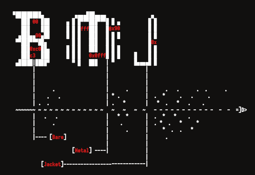

<h1 align="center"> Bare Metal Jacket </h1>  

  

   

## Introduction

BMJ contains low-level code fragments (in a form of NASM macros) that can assist in writing small, position-independent and null-free payloads. Most of the macros communicate directly with the kernel - no external dependencies (such as glibc) are needed, so the code is portable across all 64-bit GNU/Linux systems.

## Features
The framework's source is divided into 16 separate sections - each of them provides different set of macros for specific tasks.

* [ 0x01 ] --- > Stack/register/string allocation helpers (variable initialization, XOR/PUSH chaining)
* [ 0x02 ] --- > Auxiliary macros (stack operations, relative addressing, data types operations)           
* [ 0x03 ] --- > VM/debugging detection (RDTSC, number of CPU cores, file age, clock accelleration mechanism)
* [ 0x04 ] --- > Time-specific operations (time locks, timers, seeders               
* [ 0x05 ] --- > Coprocessing (forking, synchronised execution, standard filesystem mutexes, daemonization)
* [ 0x06 ] --- > IPC communication (signal handling/blocking/disposition/delivery)
* [ 0x07 ] --- > Low-level socket operations (TCP/UDP sock initialization, port binding, listeners) 
* [ 0x08 ] --- > High-level socket operations (reverse/bind shells with auth, file exfiltration)             
* [ 0x09 ] --- > Reverse TCP stagers (LKM/file/buffer retrieval)              
* [ 0x10 ] --- > Operations on files and file descriptors (reading, writing, closing, executing, mapping files)            
* [ 0x11 ] --- > Position-aware macros (section/relative label calculations)
* [ 0x12 ] --- > Administration, environment mapping (privilleges detection/elevation, power management,     crawling,process priority, shell invocation)
* [ 0x13 ] --- > Command execution
* [ 0x14 ] --- > Size padders (NOP sleds, pattern/byte fill)
* [ 0x15 ] --- > Disablers (security measures, ASLR, process inspection)
* [ < * > ] --- > Experimental code (network/signal-based c2 channels, process protection, signal throwback) 

## License
This software is under [MIT License](https://en.wikipedia.org/wiki/MIT_License)

